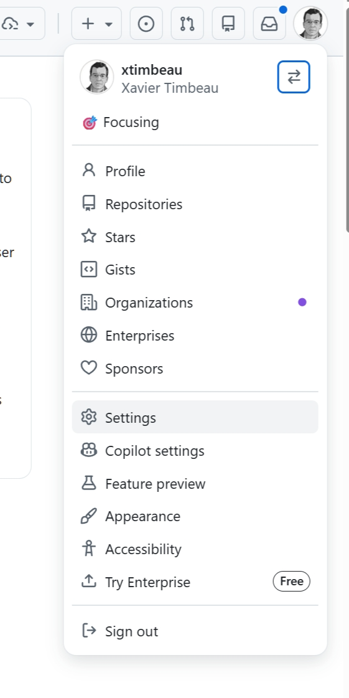
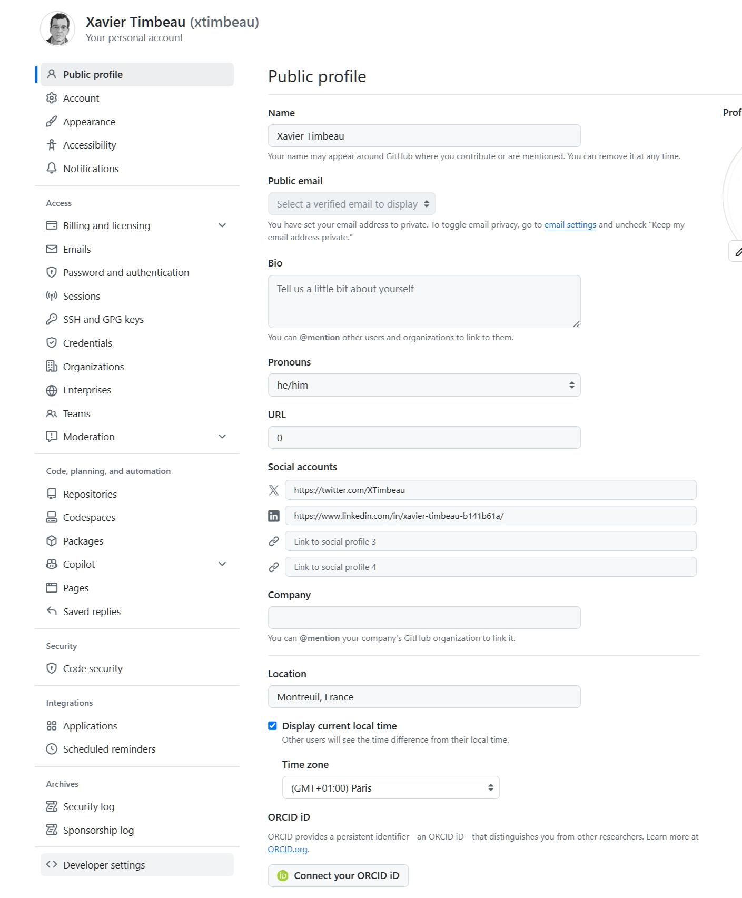
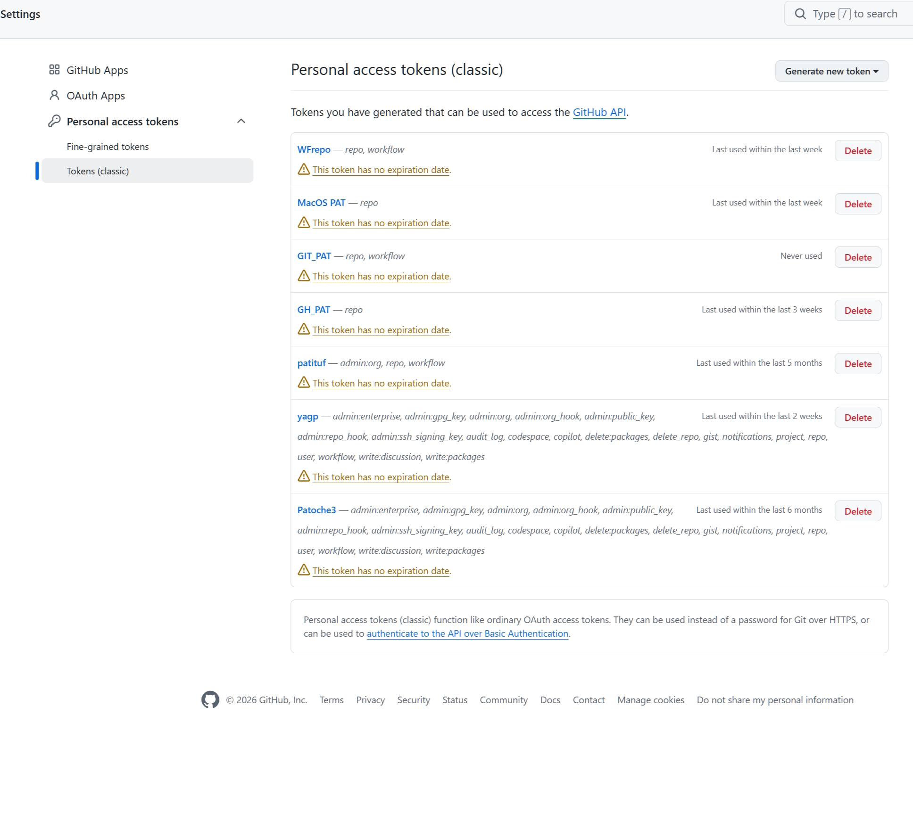

```{r, include = FALSE}
knitr::opts_chunk$set(eval = FALSE)
```

Avant de pouvoir construire et déployer un site avec `ofceweb`, il faut
configurer côté machine quelques éléments d'authentification GitHub. Ce
vignette les passe en revue. Une fois cette configuration faite,
enchaîner avec [*Construire un site avec ofceweb*](build-a-site.html).

Vue d'ensemble :

- un **PAT** (Personal Access Token) GitHub stocké comme variable
  d'environnement pour que R / git / gh puissent agir en votre nom ;
- l'outil en ligne de commande **`gh`** (GitHub CLI) authentifié via
  `gh auth login`, utilisé pour créer et supprimer les secrets de dépôt
  (notamment `STATICRYPT_PASSWORD` pour le chiffrement).

## 1. Qu'est-ce qu'un PAT GitHub ?

Un **Personal Access Token** (PAT) est un jeton qui remplace votre mot
de passe GitHub pour les opérations programmatiques (API, push HTTPS,
workflows). Il est révocable, expirable, et limité à un ensemble
explicite de droits ("scopes").

Deux variétés coexistent sur GitHub :

- **Fine-grained PAT** (complexe) : portée limitée à des dépôts précis,
  permissions très granulaires, expiration obligatoire.
- **Classic PAT (**recommandé) : scopes plus larges (`repo`, `workflow`,
  …), plus simple à créer, encore très utilisé.

`ofceweb` utilise deux variables d'environnement :

| Variable | À quoi ça sert |
|------------------|------------------------------------------------------|
| `GITHUB_PAT` | Variable historique lue par `usethis`, `gh`, `gitcreds`, … pour les appels API GitHub usuels. |
| `DEPLOY_PAT` | Lue **en priorité** par `site2branch()` / `trigger_action()` pour pousser sur la branche de déploiement et dispatcher le workflow `ftp_deploy.yml`. |

Pourquoi `DEPLOY_PAT` distinct ? Sur GitHub Actions, le `GITHUB_TOKEN`
fourni par défaut **ne peut pas** déclencher d'autres workflows
(workflow dispatch d'un workflow vers un autre). Un PAT explicite est
nécessaire pour cette opération. En local, vous pouvez très bien mettre
la même valeur dans `GITHUB_PAT` et `DEPLOY_PAT`.

## 2. Créer un PAT

### Classic PAT (recommandé)

Le classic est plus simple, il est recommandé -\>
<https://github.com/settings/tokens> → *Generate new token (classic)*.

1.  *Note* : `ofceweb-deploy`. *Expiration* : *No expiration* si vous
    préférez ne pas avoir à renouveler, sinon une date au choix.
2.  Scopes : cocher **`repo`** (couvre push + lecture) et **`workflow`**
    (dispatcher un workflow).
3.  *Generate token* → copier la valeur.

{width="150"}
{width="248"}
{width="333"}

### Fine-grained PAT (plus complexe)

1.  Aller sur <https://github.com/settings/tokens?type=beta> (ou :
    avatar en haut à droite → *Settings* → *Developer settings* →
    *Personal access tokens* → *Fine-grained tokens*).
2.  *Generate new token*.
3.  **Token name** : quelque chose de parlant (ex. `ofceweb-deploy`).
4.  **Expiration** : vous pouvez choisir *No expiration* pour éviter
    d'avoir à renouveler le token. Sinon, fixez une date et notez-la
    pour le renouveler à temps.
5.  **Resource owner** : votre compte, ou l'organisation `OFCE` si vous
    voulez un token valable sur ses dépôts (l'orga doit avoir approuvé
    les fine-grained PAT — sinon prendre un classic PAT).
6.  **Repository access** : *Only select repositories* → cocher les
    dépôts concernés (le ou les sites à déployer).
7.  **Repository permissions** — minimum requis :
    - *Contents* : **Read and write** (push vers `site-deploy` /
      `gh-pages`).
    - *Actions* : **Read and write** (dispatcher `ftp_deploy.yml`).
    - *Metadata* : **Read-only** (coché automatiquement).
    - *Secrets* : **Read and write** (si vous souhaitez gérer le secret
      `STATICRYPT_PASSWORD` via `gh secret set` avec ce token).
8.  *Generate token*.
9.  **Copier la valeur affichée** : elle ne sera plus jamais visible.

## 3. Stocker `GITHUB_PAT` et `DEPLOY_PAT` dans l'environnement

Le but : que ces deux variables soient présentes dans toute session R
que vous démarrez, sans avoir à les retaper.

### Option recommandée : `.Renviron` utilisateur

`.Renviron` est lu par R au démarrage. Le fichier utilisateur vaut pour
toutes vos sessions R, indépendamment du projet.

Depuis R :

``` r
usethis::edit_r_environ()   # ouvre ~/.Renviron
```

Ajouter (sans guillemets, sans espaces autour de `=`) :

```         
GITHUB_PAT=ghp_xxxxxxxxxxxxxxxxxxxx
DEPLOY_PAT=ghp_xxxxxxxxxxxxxxxxxxxx
```

Sauvegarder, **redémarrer R** (Session → Restart R dans RStudio).
Vérifier :

``` r
nchar(Sys.getenv("GITHUB_PAT"))   # doit être > 0
nchar(Sys.getenv("DEPLOY_PAT"))
```

Ne **jamais** commiter un `.Renviron` qui contient des tokens. Le
`.Renviron` utilisateur (`~/.Renviron`) est hors de tout dépôt, donc
sûr.

### Alternative : keystore OS via `gitcreds`

`site2branch()` et `trigger_action()` retombent sur le keystore du
système (Keychain sur macOS, Credential Manager sur Windows) si
`DEPLOY_PAT` n'est pas défini :

``` r
gitcreds::gitcreds_set()    # demande URL + token, écrit dans le keystore
```

C'est pratique mais moins explicite — privilégier `.Renviron` pour
`ofceweb` et garder `gitcreds` pour un usage git HTTPS générique.

### Renouvellement

Quand le token expire :

1.  Régénérer un PAT (mêmes scopes).
2.  Rouvrir `~/.Renviron` (`usethis::edit_r_environ()`), remplacer la
    valeur, redémarrer R.
3.  Si vous utilisiez aussi `gh` avec ce token, refaire `gh auth login`
    (§5).

## 4. Installer `gh` (GitHub CLI)

`gh` est le CLI officiel de GitHub. Il est utilisé pour gérer les
secrets de dépôt (`gh secret set` / `gh secret delete`), notamment pour
activer ou désactiver le chiffrement staticrypt via le secret
`STATICRYPT_PASSWORD`. C'est un binaire indépendant de R.

### macOS

Via Homebrew (recommandé) :

``` sh
brew install gh
```

Sans Homebrew : télécharger le `.pkg` sur
<https://github.com/cli/cli/releases> et l'installer.

Vérifier :

``` sh
gh --version
```

### Windows

Au choix :

- **winget** (préinstallé sur Windows 11 / Windows 10 récents) :

  ``` powershell
  winget install --id GitHub.cli
  ```

- **Scoop** :

  ``` powershell
  scoop install gh
  ```

- **Installeur MSI** : télécharger sur
  <https://github.com/cli/cli/releases> et exécuter.

Après installation, **fermer puis rouvrir** le terminal (et RStudio si
lancé) pour que `gh` soit dans le `PATH`. Vérifier :

``` powershell
gh --version
```

## 5. `gh auth login`

Authentifie `gh` auprès de GitHub. À faire une fois par machine.

``` sh
gh auth login
```

Réponses recommandées au prompt interactif :

| Question | Réponse |
|---------------------------------------------|---------------------------|
| What account do you want to log into? | **GitHub.com** |
| What is your preferred protocol for Git operations? | **HTTPS** |
| Authenticate Git with your GitHub credentials? | **Y** (Yes) |
| How would you like to authenticate GitHub CLI? | **Login with a web browser** (le plus simple) — ou *Paste an authentication token* si vous voulez réutiliser un PAT existant. |

Si vous choisissez *web browser* :

1.  `gh` affiche un code à 8 caractères (ex. `ABCD-1234`).
2.  Appuyer sur Entrée → le navigateur s'ouvre sur
    <https://github.com/login/device>.
3.  Coller le code, valider, autoriser `gh`.
4.  Retour au terminal : `✓ Authentication complete.`

Si vous choisissez *paste a token* : coller un classic PAT avec les
scopes `repo`, `workflow`, `read:org` (et `admin:public_key` si vous
voulez aussi qu'`gh` gère vos clés SSH). Les fine-grained PAT ne sont
pas (encore) acceptés ici de manière fiable — préférer le flux
navigateur si vous n'avez qu'un fine-grained.

Vérifier :

``` sh
gh auth status
```

Doit afficher quelque chose comme :

```         
github.com
  ✓ Logged in to github.com as <vous> (oauth_token)
  ✓ Git operations for github.com configured to use https protocol.
  ✓ Token: gho_************************
```

À ce stade, vous pouvez gérer les secrets de dépôt via `gh secret set`
et toute la chaîne `ofceweb` est opérationnelle.

## Récapitulatif

``` r
# dans R
usethis::edit_r_environ()
# y coller :
#   GITHUB_PAT=ghp_…
#   DEPLOY_PAT=ghp_…
# redémarrer R
```

``` sh
# dans un terminal
brew install gh        # macOS
# ou : winget install --id GitHub.cli   (Windows)
gh auth login          # suivre le prompt, HTTPS + web browser
gh auth status         # vérification
```

## Vérification automatique

`setup_prev()`, `setup_wp()`, `check_prev()` et `check_wp()` exécutent
tous un diagnostic automatique de ces pré-requis (CLI `gh` installé et
authentifié, jeton `DEPLOY_PAT`/`gitcreds` disponible, identité git
`user.name`/`user.email` configurée). Chaque défaut déclenche un simple
avertissement (non bloquant) qui renvoie vers ce vignette :

``` r
nchar(Sys.getenv("DEPLOY_PAT"))   # doit être > 0
```

Ensuite, voir [*Construire un site avec ofceweb*](build-a-site.html)
pour l'enchaînement `setup_site()` → `render_site()` → `deploy_site()`.
